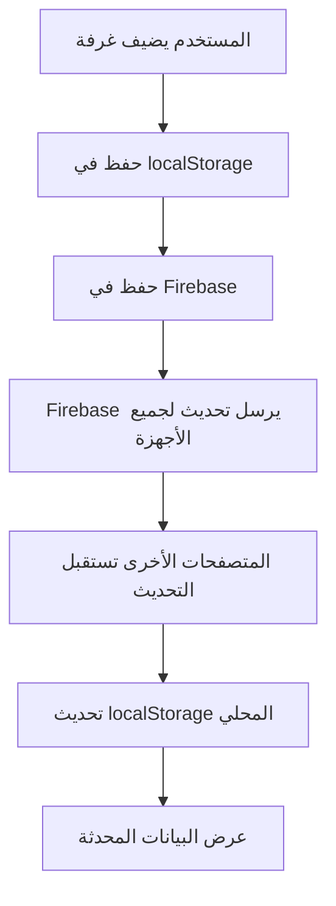

# 🔄 نظام مزامنة الغرف مع Firebase

## 📋 نظرة عامة

تم تحديث نظام إدارة الغرف والنزلاء ليستخدم **Firebase Firestore** كقاعدة بيانات سحابية مشتركة، مما يضمن توفر البيانات عبر جميع الأجهزة والمتصفحات.

## ✨ المميزات الجديدة

### 1. **مزامنة تلقائية في الوقت الفعلي**
- 🔄 البيانات تُحدث فوراً على جميع الأجهزة المتصلة
- ☁️ حفظ تلقائي في السحابة عند أي تعديل
- 📱 الوصول من أي جهاز أو متصفح

### 2. **نسخ احتياطي مزدوج**
- 💾 **Firebase** (قاعدة البيانات الأساسية)
- 🗃️ **localStorage** (نسخة احتياطية محلية للوصول السريع)

### 3. **مؤشرات حالة الاتصال**
- ☁️ **أخضر**: متصل بالسحابة وجاري المزامنة
- 🟡 **أصفر**: جاري المزامنة...
- 🔴 **أحمر**: وضع محلي فقط (بدون اتصال بالإنترنت)

## 🚀 كيفية الاستخدام

### إضافة غرفة جديدة
```
1. افتح الإعدادات > إدارة الغرف
2. اضغط "إضافة غرفة"
3. أدخل البيانات (رقم الغرفة، النوع، الطابق)
4. احفظ
✅ سيتم حفظ الغرفة في Firebase تلقائياً
```

### إضافة نزيل جديد
```
1. افتح إدارة الشقق
2. اضغط "إضافة نزيل"
3. أدخل بيانات النزيل كاملة
4. اختر رقم الغرفة
✅ سيتم تحديث حالة الغرفة في Firebase فوراً
```

### الوصول من متصفح آخر
```
1. افتح النظام من أي متصفح أو جهاز
2. سجل الدخول بحسابك
3. ستظهر جميع الغرف والنزلاء تلقائياً
✅ المزامنة تتم في الخلفية
```

## 🔧 التفاصيل التقنية

### الملفات المحدثة

#### 1. `src/lib/firebase-sync.ts` (جديد)
الوظائف الرئيسية:
- ✅ `saveRoomsToFirebase()` - حفظ الغرف في Firebase
- ✅ `getRoomsFromFirebase()` - جلب الغرف من Firebase
- ✅ `subscribeToRooms()` - الاستماع للتحديثات الفورية
- ✅ `syncLocalDataToFirebase()` - مزامنة البيانات المحلية

#### 2. `src/app/dashboard/settings/rooms-management/page.tsx`
التحديثات:
- ✅ استخدام Firebase في جميع عمليات CRUD
- ✅ مؤشر حالة الاتصال في الهيدر
- ✅ مزامنة تلقائية عند التحديثات

### قواعد Firestore

```javascript
// firestore.rules
match /hotel_rooms/{roomId} {
  allow read, write: if request.auth != null;
}
```

### هيكل البيانات في Firebase

```typescript
Collection: hotel_rooms
  └── Document: room_{timestamp}
        ├── id: string
        ├── number: string
        ├── type: string
        ├── floor: number
        ├── status: RoomStatus
        ├── balance: number
        ├── guestName?: string
        ├── guestPhone?: string
        ├── events: RoomEvent[]
        └── lastUpdated: Timestamp
```

## 🔍 استكشاف الأخطاء

### المشكلة: لا تظهر البيانات في متصفح آخر
**الحل:**
1. تأكد من تسجيل الدخول بنفس الحساب
2. تحقق من اتصال الإنترنت
3. انظر إلى مؤشر الاتصال في الهيدر

### المشكلة: مؤشر أحمر (وضع محلي فقط)
**الأسباب المحتملة:**
- ❌ لا يوجد اتصال بالإنترنت
- ❌ مشكلة في Firebase credentials
- ❌ قواعد Firestore تمنع الوصول

**الحل:**
1. تحقق من الإنترنت
2. راجع Firebase Console
3. تأكد من تسجيل الدخول

### المشكلة: التحديثات بطيئة
**الحل:**
- عادية - Firebase يحتاج ثواني قليلة للمزامنة
- إذا استمرت المشكلة، تحقق من سرعة الإنترنت

## 📊 آلية العمل



## 🎯 الفوائد

### للموظفين
- ✅ إضافة نزيل من جهاز الاستقبال يظهر فوراً في الإدارة
- ✅ تحديث حالة الغرفة يظهر لجميع الموظفين
- ✅ لا حاجة لتحديث الصفحة يدوياً

### للإدارة
- ✅ متابعة الغرف في الوقت الفعلي من أي مكان
- ✅ تقارير دقيقة بدون تأخير
- ✅ نسخ احتياطي تلقائي في السحابة

### للنزلاء
- ✅ طلباتهم تصل فوراً لجميع الأقسام
- ✅ تحديثات سريعة على حالة الطلبات
- ✅ تجربة أفضل بدون تأخير

## 🔐 الأمان

- ✅ جميع البيانات مشفرة في Firebase
- ✅ الوصول محمي بتسجيل الدخول
- ✅ قواعد Firestore تمنع الوصول غير المصرح

## 📱 التوافق

- ✅ Chrome, Firefox, Safari, Edge
- ✅ Android, iOS, Windows, Mac
- ✅ Desktop, Tablet, Mobile

## 🔄 المزامنة التلقائية

### عند فتح الصفحة
```typescript
1. جلب البيانات من Firebase
2. إذا كانت Firebase فارغة:
   - رفع البيانات من localStorage إلى Firebase
3. تحديث localStorage من Firebase
4. بدء الاستماع للتحديثات الفورية
```

### عند إضافة/تعديل/حذف
```typescript
1. تحديث الحالة المحلية (State)
2. حفظ في localStorage
3. حفظ في Firebase
4. Firebase يرسل التحديث للأجهزة الأخرى
```

## 💡 نصائح

1. **تسجيل الدخول دائماً**: للحصول على المزامنة الكاملة
2. **اتصال مستقر**: للحصول على تحديثات فورية
3. **لا تحذف localStorage يدوياً**: سيتم المزامنة تلقائياً

## 🎉 الخلاصة

الآن النظام يستخدم **Firebase** كمصدر موحد للبيانات:
- ✅ أضف غرفة من متصفح Chrome → تظهر في Firefox
- ✅ أضف نزيل من الموبايل → يظهر على الكمبيوتر
- ✅ حدث حالة غرفة → التحديث يظهر فوراً للجميع

**لم تعد البيانات محلية - أصبحت سحابية ومشتركة! ☁️🎯**
