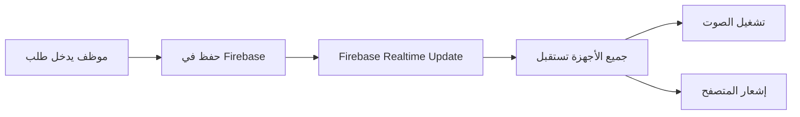

# 🔔 دليل نظام الإشعارات الصوتية

## نظرة عامة

تم تفعيل نظام إشعارات صوتية متقدم يعمل في الوقت الفعلي عبر Firebase، يضمن وصول الإشعارات الصوتية لجميع الأجهزة المفتوحة فوراً عند إنشاء طلب جديد.

---

## ✨ المميزات

### 1. **إشعارات فورية في الوقت الفعلي**
- ✅ يعمل عبر Firebase Realtime Database
- ✅ لا حاجة لتحديث الصفحة
- ✅ يصل الإشعار لجميع الأجهزة في نفس اللحظة

### 2. **أصوات احترافية**
- 🔊 صوت طلب جديد: 3 نغمات متصاعدة (600Hz → 800Hz → 1000Hz)
- ✅ صوت موافقة: نغمتين صاعدتين
- ❌ صوت رفض: نغمتين هابطتين
- ℹ️ صوت عام: نغمتين متماثلتين

### 3. **إشعارات المتصفح**
- 📱 إشعارات سطح المكتب
- 🔔 تظهر حتى عند تصغير المتصفح
- 👆 النقر على الإشعار يفتح صفحة الطلبات

### 4. **دعم جميع المصادر**
- ☕ الكوفي شوب
- 🍽️ المطعم
- 🧺 المغسلة
- 📱 تطبيق الضيف

---

## 🚀 كيفية الاستخدام

### للموظفين:

1. **تسجيل الدخول للـ Dashboard**
   - سيطلب منك المتصفح إذن الإشعارات
   - اضغط "السماح" لتفعيل الإشعارات

2. **استقبال الإشعارات**
   - عند إنشاء طلب جديد، ستسمع صوت تنبيه تلقائياً
   - سيظهر إشعار في المتصفح مع تفاصيل الطلب
   - يمكنك النقر على الإشعار للانتقال لصفحة الطلبات

3. **إدارة الإشعارات**
   - يمكنك كتم الصوت من إعدادات المتصفح
   - يمكنك تعطيل الإشعارات من إعدادات المتصفح

### للضيوف:

1. **إرسال طلب من التطبيق**
   - افتح تطبيق الضيف
   - اختر الخدمة (مطعم/كوفي/مغسلة)
   - أضف العناصر للسلة
   - اضغط "الدفع والطلب"

2. **تأكيد الطلب**
   - سيصل إشعار فوري لجميع الموظفين
   - سيتم تشغيل صوت تنبيه في جميع الأجهزة
   - سيتم عرض الطلب في صفحة الطلبات

---

## 🔧 التفاصيل التقنية

### البنية التحتية

```
Firebase Realtime Database
         ↓
  guest-requests collection
         ↓
   onSnapshot listener
         ↓
  Firebase Notifications System
         ↓
    ┌─────────┬─────────┬─────────┐
    ↓         ↓         ↓         ↓
 Device 1  Device 2  Device 3  Device N
    ↓         ↓         ↓         ↓
  🔊 Sound  🔊 Sound  🔊 Sound  🔊 Sound
```

### الملفات الرئيسية

#### 1. `src/lib/firebase-notifications.ts`
نظام الإشعارات الرئيسي الذي يراقب Firebase

**الدوال الرئيسية:**
```typescript
// بدء مراقبة الطلبات الجديدة
startFirebaseNotifications()

// إيقاف المراقبة
stopFirebaseNotifications()

// طلب إذن الإشعارات
requestNotificationPermission()

// إظهار إشعار المتصفح
showBrowserNotification(request, requestId)
```

#### 2. `src/app/dashboard/layout.tsx`
صفحة Layout الرئيسية التي تبدأ نظام الإشعارات

**التكامل:**
```typescript
useEffect(() => {
  if (user) {
    // طلب إذن الإشعارات
    requestNotificationPermission()
    
    // بدء المراقبة
    startFirebaseNotifications()
    
    // التنظيف عند الخروج
    return () => stopFirebaseNotifications()
  }
}, [user])
```

#### 3. `src/lib/notification-sounds.ts`
نظام الأصوات الذي يولد النغمات

**الأصوات المتاحة:**
```typescript
playNotificationSound('new-request')  // طلب جديد
playNotificationSound('approval')     // موافقة
playNotificationSound('rejection')    // رفض
playNotificationSound('general')      // عام
```

---

## 📊 سير العمل

### 1. إنشاء طلب من الكوفي شوب



### 2. إنشاء طلب من تطبيق الضيف


---

## 🎯 حالات الاستخدام

### الحالة 1: موظف استقبال + موظف كوفي
- موظف الاستقبال يدخل طلب كوفي لغرفة 101
- يصل إشعار صوتي فوري لموظف الكوفي
- يصل إشعار صوتي لموظف الاستقبال أيضاً (للتأكيد)

### الحالة 2: ضيف يطلب من التطبيق
- ضيف في غرفة 205 يطلب وجبة من المطعم
- يصل إشعار صوتي لجميع الموظفين المسجلين
- يظهر الطلب في صفحة الطلبات فوراً

### الحالة 3: عدة أجهزة مفتوحة
- 3 أجهزة مفتوحة في الاستقبال والمطعم والكوفي
- عند إنشاء طلب، جميع الأجهزة تستقبل الإشعار
- الصوت يعمل في جميع الأجهزة في نفس الوقت

---

## ⚙️ الإعدادات

### إعدادات المتصفح

#### Chrome/Edge:
1. اذهب إلى الإعدادات → الخصوصية والأمان → إعدادات الموقع
2. ابحث عن "الإشعارات"
3. تأكد من أن الموقع مسموح له بإرسال الإشعارات

#### Firefox:
1. اذهب إلى الإعدادات → الخصوصية والأمان
2. ابحث عن "الأذونات" → "الإشعارات"
3. تأكد من أن الموقع مسموح له

#### Safari:
1. Safari → التفضيلات → مواقع الويب
2. اختر "الإشعارات"
3. تأكد من أن الموقع مسموح له

### إعدادات الصوت

يمكنك التحكم بالصوت من:
- 🔊 إعدادات النظام (مستوى الصوت العام)
- 🔇 إعدادات المتصفح (كتم الصوت لموقع معين)
- 🎚️ إعدادات التطبيق (قريباً)

---

## 🐛 حل المشاكل

### المشكلة: لا يصل الصوت

**الحلول:**
1. ✅ تحقق من أن الصوت غير مكتوم في المتصفح
2. ✅ تحقق من أن مستوى الصوت في النظام ليس صفر
3. ✅ تحقق من Console في المتصفح للأخطاء
4. ✅ جرب تحديث الصفحة

### المشكلة: لا تظهر إشعارات المتصفح

**الحلول:**
1. ✅ تحقق من أن إذن الإشعارات مفعّل
2. ✅ اذهب إلى إعدادات المتصفح وتأكد من السماح للموقع
3. ✅ جرب إعادة تسجيل الدخول

### المشكلة: الإشعارات تتكرر

**الحلول:**
1. ✅ أغلق التابات المكررة
2. ✅ حدّث الصفحة
3. ✅ امسح الـ Cache

### المشكلة: تأخر في وصول الإشعارات

**الحلول:**
1. ✅ تحقق من اتصال الإنترنت
2. ✅ تحقق من اتصال Firebase (Console)
3. ✅ جرب إعادة تسجيل الدخول

---

## 📈 الإحصائيات والمراقبة

### في Console المتصفح:

```javascript
// عند بدء المراقبة
🔔 Starting Firebase notifications listener...
✅ Firebase notifications listener started successfully

// عند استقبال طلب جديد
🆕 New request detected: {
  id: "abc123",
  type: "طلب من الكوفي شوب",
  room: "101",
  time: "2024-01-15 10:30:00"
}
🔊 Playing new-request sound...
✅ Notification sound played successfully

// عند إيقاف المراقبة
🔕 Stopping Firebase notifications listener...
```

---

## 🔐 الأمان والخصوصية

### الأذونات المطلوبة:
- 🔔 **إشعارات المتصفح**: لإظهار الإشعارات
- 🔊 **تشغيل الصوت**: لتشغيل نغمات التنبيه

### البيانات المستخدمة:
- ✅ معلومات الطلب (رقم الغرفة، نوع الطلب، الوصف)
- ✅ وقت إنشاء الطلب
- ❌ لا يتم جمع أي بيانات شخصية إضافية

### الخصوصية:
- ✅ الإشعارات محلية فقط (لا يتم إرسالها لخوادم خارجية)
- ✅ يمكن تعطيل الإشعارات في أي وقت
- ✅ لا يتم تخزين سجل الإشعارات

---

## 🎓 نصائح للاستخدام الأمثل

### للموظفين:

1. **اترك التاب مفتوحاً**
   - احتفظ بتاب Dashboard مفتوح دائماً
   - حتى لو كنت تعمل في تاب آخر، ستصلك الإشعارات

2. **فعّل الإشعارات**
   - اسمح للمتصفح بإرسال الإشعارات
   - ستصلك الإشعارات حتى عند تصغير المتصفح

3. **اضبط مستوى الصوت**
   - اضبط مستوى الصوت المناسب
   - ليس عالياً جداً وليس منخفضاً جداً

### للمدراء:

1. **تدريب الموظفين**
   - درّب الموظفين على استخدام النظام
   - تأكد من أنهم يفهمون كيفية تفعيل الإشعارات

2. **مراقبة الأداء**
   - راقب Console للتأكد من عدم وجود أخطاء
   - تحقق من أن جميع الأجهزة تستقبل الإشعارات

3. **صيانة دورية**
   - امسح الـ Cache بشكل دوري
   - حدّث المتصفح للإصدار الأحدث

---

## 📞 الدعم الفني

### إذا واجهت مشكلة:

1. **تحقق من Console**
   - افتح Developer Tools (F12)
   - اذهب إلى تاب Console
   - ابحث عن رسائل الخطأ باللون الأحمر

2. **جرب الحلول الأساسية**
   - حدّث الصفحة
   - امسح الـ Cache
   - أعد تسجيل الدخول

3. **اتصل بالدعم**
   - أرسل screenshot من Console
   - اشرح المشكلة بالتفصيل
   - اذكر المتصفح والنظام المستخدم

---

## 🎉 الخلاصة

نظام الإشعارات الصوتية الآن مفعّل بالكامل ويعمل في الوقت الفعلي عبر Firebase. جميع الطلبات من أي مصدر (كوفي، مطعم، مغسلة، تطبيق ضيف) ستصل فوراً لجميع الأجهزة المفتوحة مع صوت تنبيه احترافي.

**المميزات الرئيسية:**
- ✅ إشعارات فورية في الوقت الفعلي
- ✅ أصوات احترافية مولدة بـ Web Audio API
- ✅ إشعارات المتصفح
- ✅ دعم جميع المصادر
- ✅ يعمل على جميع الأجهزة المفتوحة

**استمتع بتجربة إشعارات سلسة واحترافية! 🎊**
